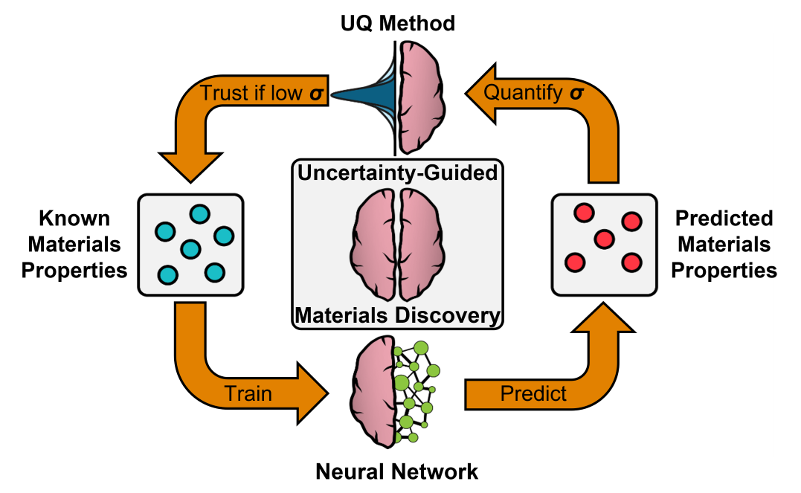

**Clarifying Trust of Materials Property Predictions using Neural Networks with Distribution-specific Uncertainty Quantification**
___
Uncertainty quantification (UQ) refers to some measure of variability in the presence of imperfect or incomplete information. In the context of AI models, the predictive uncertainty could arise from an imperfectly designed model. In the context of materials predictions, the uncertainty could arise from the materials dataset itself, such as dataset sparsity. Often, different sources of uncertainty are significant and at play in AI-guided materials screening strategies. **UQ methods quantify the uncertainty arising from these sources.**

**Many advanced materials discovery strategies are enhanced by trustworthy UQ.** For example, if the uncertainty intervals of materials predictions behave similarly to a confidence interval, then the uncertainty can be used to infer the accuracy of millions of materials predictions without having to explicitly simulate millions of materials or synthesize them in the lab—this is uncertainty-enhanced high-throughput screening.

Neural networks are a class of AI model that often outperform other model classes on diverse, sparse, challenging materials datasets, **yet the uncertainty of neural networks, their associated materials tasks, and datasets are not well-understood and not well-adopted—thereby limiting their use in advanced materials discovery strategies.**

Uncertainty arises from different sources in AI-guided screening efforts. Moreover, independent of the mathematics, the predictive uncertainty is amenable to different interpretations. UQ methods can wildly differ in how they quantify the uncertainty of materials predictions. **This work addresses two key questions:**

1. **If uncertainty is a general concept that is amenable to interpretation, then what is a common framework to clarify trustworthy uncertainty quantification across applications?**
   
2. **Which UQ methods are suggestible as practical, tractable, and trustworthy options for advanced materials discovery strategies that represent a larger multi-component software effort?**
___

# Table of Contents

___

# Installation

___

# Quick Start Guide

___

# Citation
If you found this work to be helpful, please cite our paper:

`Gruich, C. J., Madhavan, V., Wang, Y., & Goldsmith, B. R. (2023). Clarifying trust of materials property predictions using neural networks with distribution-specific uncertainty quantification. Machine Learning: Science and Technology, 4(2), 025019.`

If you found our written visualization code to be helpful, please additionally cite the Uncertainty Toolbox:

`@article{chung2021uncertainty,
  title={Uncertainty Toolbox: an Open-Source Library for Assessing, Visualizing, and Improving Uncertainty Quantification},
  author={Chung, Youngseog and Char, Ian and Guo, Han and Schneider, Jeff and Neiswanger, Willie},
  journal={arXiv preprint arXiv:2109.10254},
  year={2021}
}`

Lastly, if you found our implementation of evidential regression onto a CGCNN to be helpful, please cite the original evidential regression paper:

`@article{amini2020deep,
  title={Deep evidential regression},
  author={Amini, Alexander and Schwarting, Wilko and Soleimany, Ava and Rus, Daniela},
  journal={Advances in Neural Information Processing Systems},
  volume={33},
  year={2020}
}`

___
